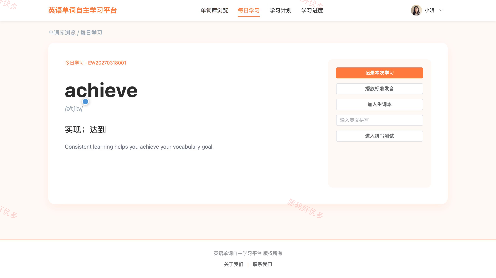
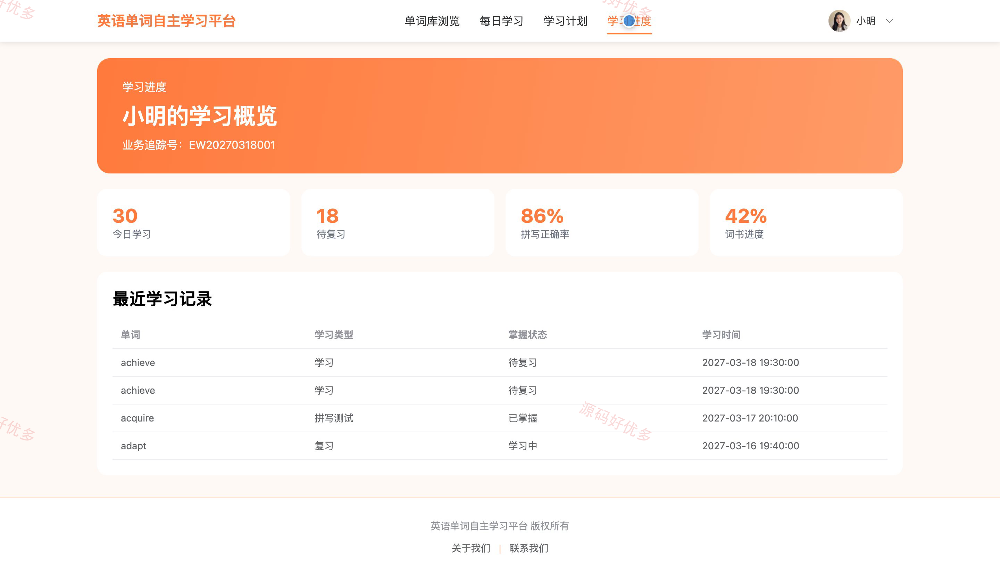
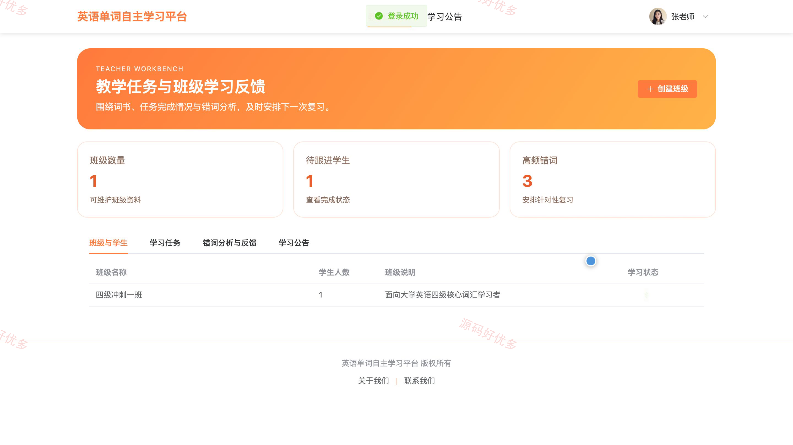
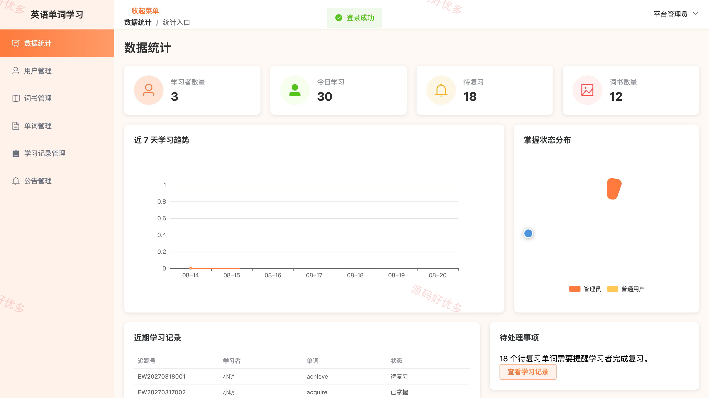
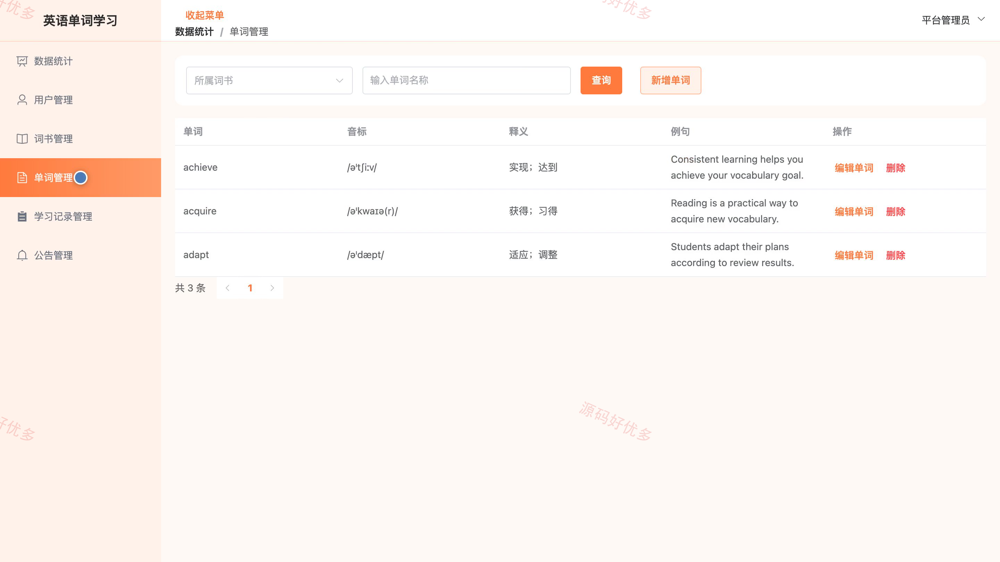
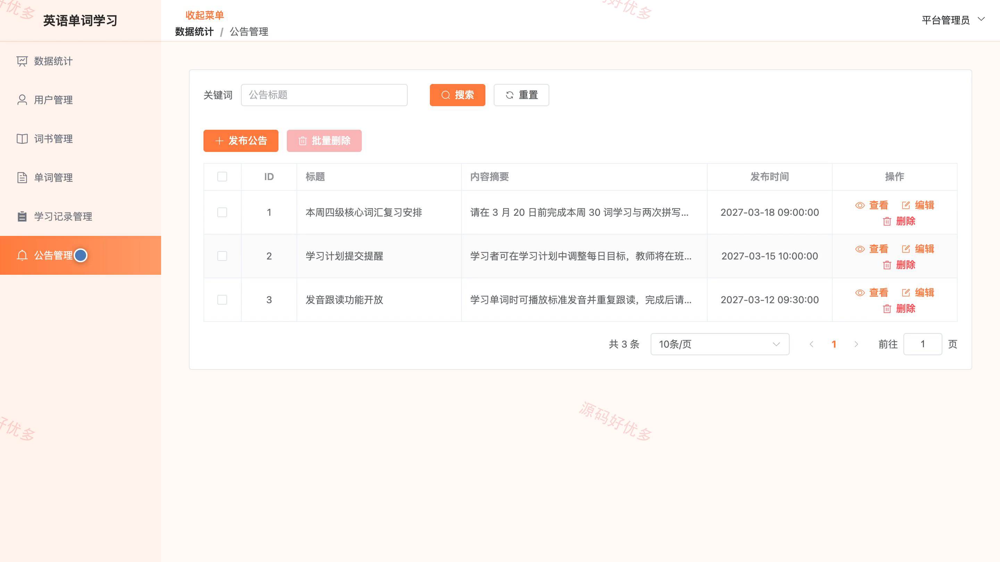

## 源码问题查看主页咨询

### 一、关键词
英语单词学习、词汇记忆、背单词、单词测试、词汇复习

### 二、作品包含
源码+数据库+全套环境和工具资源+本地部署教程

### 三、项目技术
前端技术： Html、Css、Js、Vue3.4、Element-Plus
后端技术：Java、SpringBoot3.2.0、MyBatis-Plus

### 四、运行环境（以下版本亲测，其他版本兼容性请自行测试）
开发工具：IDEA/eclipse + VSCODE

数据库：MySQL5.7+（共13张表）

数据库管理工具：Navicat10以上版本

环境配置软件： JDK17 + Maven

前端Nodejs：16+

浏览器：谷歌浏览器

### 五、项目介绍
项目编号：bs054A

英语单词自主学习平台面向学生、教师和管理员，围绕词书与单词资源、学习计划、每日学习、拼写测试、生词复习、班级任务和学习反馈形成完整学习闭环，支持学生跟踪词汇进度、教师掌握班级学习情况，并由管理员统一维护学习资源与基础数据。

角色：学生、教师、管理员

学生功能：账号注册与登录、单词库浏览、学习计划、每日单词学习、拼写测试、生词本复习、学习进度、学习公告查看。

教师功能：班级管理、学生学习状态查看、学习任务发布、任务完成情况查看、班级错词分析、学习公告查看、学习反馈管理。

管理员功能：学习数据看板、用户管理、词书管理、单词管理、班级教师维护、公告管理、学习记录管理、个人信息维护。

### 六、运行截图

